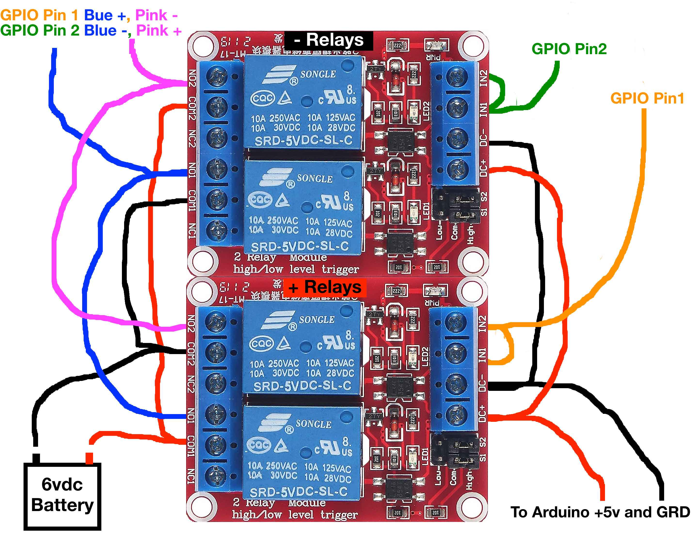
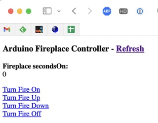

# fireplace-homebrige-controller

**The Background**

We have an old Jotul gas fireplace. It has a built-in mechanical thermostat and a remote wall switch. The switch remotely twists the dial of the thermostat. The thermostat does not have any temperature markings. You just turn it up until the fireplace turns on. As the air warms around the fireplace, it will adjust the flame level to maintain the "set" temperature. It can adjust the flame level from off to very high depending on how large the delta between set temp and desired temp.

**The Goal**

1. Have the ability to turn the fireplace off at a specific time every day. The fireplace will often be on (thermostat set to something above minimum) but the flame will be off. As the house cools at night, the fire will cycle on/off to maintain the set temp which wastes gas.
2. Have the ability to adjust the fireplace via Apple Home.

**Fireplace built-in controller**

The fireplace uses a 6vdc battery pack to facilitate temp adjustment via the remore switch.

The switch is a simple momentary toggle switch with UP sending +6vdc to the motor actuator on the thermostat. Down sends -6vdc.

**Fireplace automation plan**

1. Arduino with Ethernet and POE. There is no power at the fireplace. I figured that running ethernet from my garage POE switch, under the house to the fireplace and then drilling an small access hole for the ethernet was my easiest method of getting power to new controller.
2. A relay circuit that can send the +6vdc and -6vdc to the thermostat motor actuator based on an input voltage from the arduino representing UP and DOWN requests.
3. Ardiuno code to handle requests to turn the fireplace ON, OFF, UP, or DOWN as well as track status.
4. Arduino code to handle web requests for the 4 fireplace requests listed above as well as present the current status of the fireplace. Note that the status can only track requests made via the web interface. Any physical changes via the wall switch cannot be tracked.
5. Configure a Homebridge plugin to make the fireplace controller functions present as Devices to Apple Home.
6. Add Apple Home Automation to turn the fireplace off at midnight every day.

**Arduino hardware**

I did my controller prototyping using an old arduino uno kit. Basically just getting LEDs to light up in a pattern that matches what I want the fireplace to do.

To get ethernet and POE, I did some searches and found the Arduino ethernet shield, but also discovered that the POE version has been discontinued. I did find the POE Module which has to be soldered onto the Ethernet Shield. Note that the POE modules come in isolated and non-isolated. Get the isolated version or else you can get power backfed from the POE to the USB on the Arduino and potentially damage your computers USB port.

I purchased a New Arduino Uno, Ethernet Shield and Silvertel Ag9050-S POE module from mouser.com for $85 shipped. Kind of spendy.

If I were to do another one, I would switch to the Olimex ESP32-POE-ISO. It is smaller and cheaper at $25 from Mouser.com.

**Relay curcuit**

I am sure this is overly complex, but it works.

I attempted to the an Arduino Relay Shield. It worked great for the prototype but was incompatible with the ethernet shield.

I used 2 [DC 5V Relay Module 2 Channel Relay Board with Optocoupler Support High or Low Level Trigger](https://www.amazon.com/dp/B099MC4TJD?psc=1&ref=ppx_yo2ov_dt_b_product_details).

These are good relays in that they are decoupled from the controller by the optocouplers and the can handle 10A loads for both 30vdc and 125vac. Total overkill for this 6vdc user, but they work.

1 pair of relays activate together to provide +6vdc for turning the fireplace up. The other pair of relays activate together to provide -6vdc for turning the fireplace down.

**Fireplace Control Logic**

ON: It normally takes about 5 seconds of holding the fireplace up button to adjust the thermostat so that the fireplace turns on with medium flame. fireOn for onSeconds (5) seconds.

UP: Holding the button for 1-2 seconds usually turns the flame up higher, or if off from the thermostat, turns it back on. I a defining a variable incrementSeconds for these small adjustments. fireUp for incrementSeconds.

DOWN: Holding the button for 1-2 seconds usually lowers the flame a bit. fireDown for incrementSeconds.

OFF: Hold until you hear the clutch on the thermostat engage indicating that the minimum setting has been reached. My plan is to track the seconds of "ON" and as a couple of seconds and then run fireDown for that long. fireDown for current-seconds-of-on + 2 more seconds.

case: If the fireplace is on, but the thermostat has lowered the actual flames to off, someone might choose to turn the fireplace ON and thus apply 5 seconds of fireUP. If current-seconds-of-on is > 0, just turn the fire up by 2 increments.

**Fireplace Control Web Interface**

I based my web interface on examples from Rui Santos found at [http://randomnerdtutorials.com](http://randomnerdtutorials.com).

I wanted separate URIs for each function.  
/fireon  
/fireup
/foredown
/fireoff
/ - has the links and displays current-seconds-of-on as a status.

The look of the web ui was not important, as the functions will be called via a Homebridge Plugin.

**[homebridge-http-switch](https://github.com/Supereg/homebridge-http-switch) plugin**

I chose this plugin as it has a stateless switch. Most devices are statefull with ON/OFF states or some dimmer level. I considered treating this like a dimmer, but decided to more closely mirror the manual interface of the fireplace.

See homebridge-http-switch.json for details.

In the plugin config you define a config for each accessory. In my case, I have 4 accessories, as each control is treated as an independent accessory. 

Additionally, I am choosing to not run these as child bridges, as the plugin wants to treat each device as a separate child bridge.

**Apple Home**

In Apple Home, choose to edit your Home Setting (top right, circle with dots).  
Select Home Hubs & Bridges.  
Select your Homebridge and then click on Accessories.  
Here you should see all the devices associated with that Homebrige. Based on my config for homebridge-http-switch I see 4 accessories: Fireplace On, Fireplace Up, Fireplace Down, and Fireplace Off. My Homebridge server is in the garage, so the homebridge and all it's accessories are in the Garage, by default. Right click each Fireplace accessory and change it's room. In my case, Living Room.

Now I have 4 Fireplace switches in my Living room. Toggle any of the switches on and it returns to the off state, mimicing the behaviour of the fireplace wall switch.

Last, add an Automation.  
Choose Time of day Occurs.  
Choose the time you want this to run, in my case 12:30AM and the days. Click Next.  
Scroll to find "Fireplace Off" and select it. Next.  
You can then test the automation or click Done.
 

 
